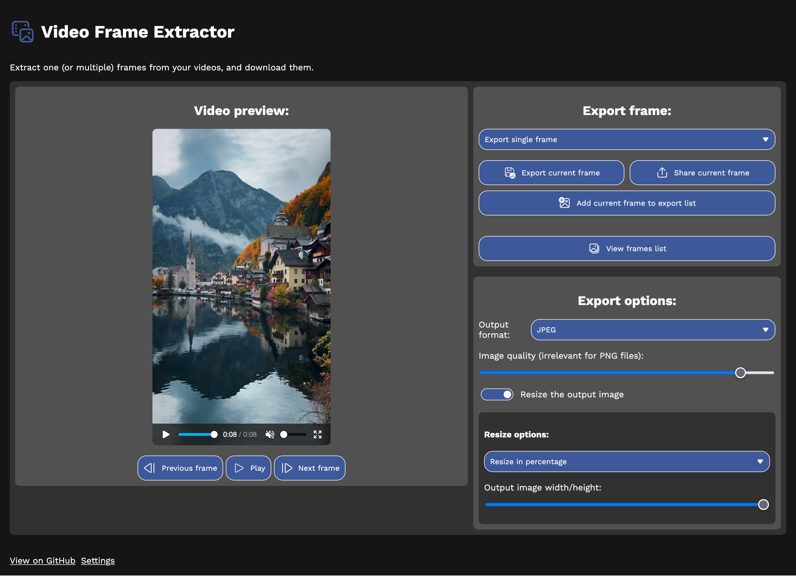
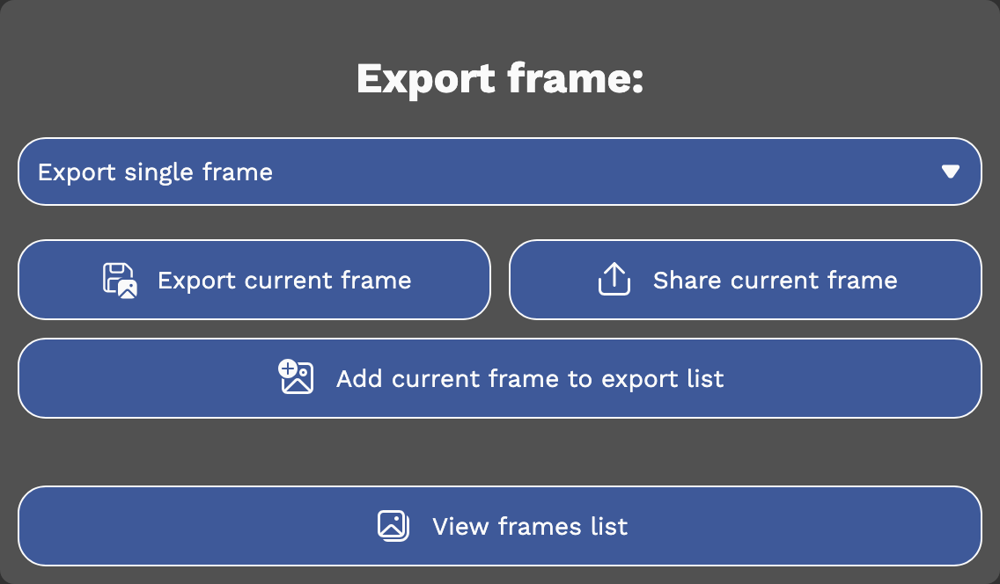
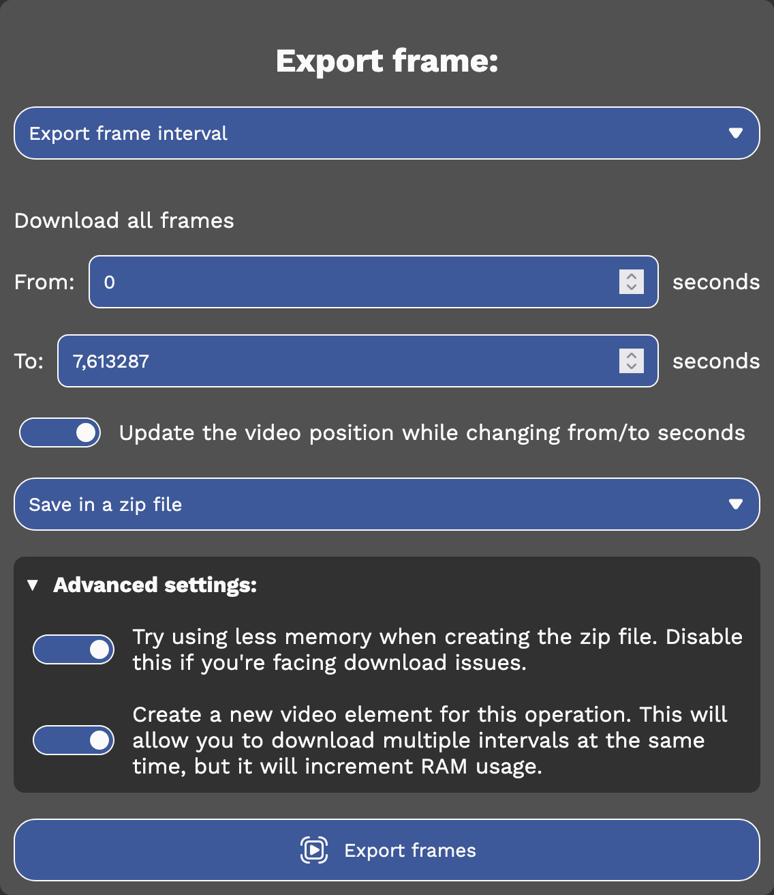
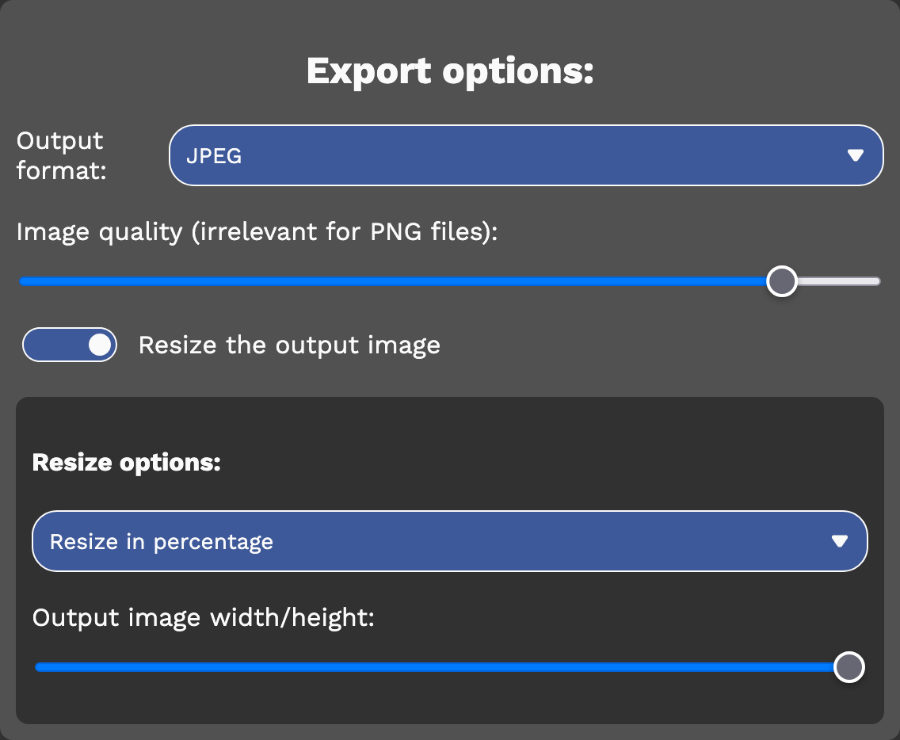
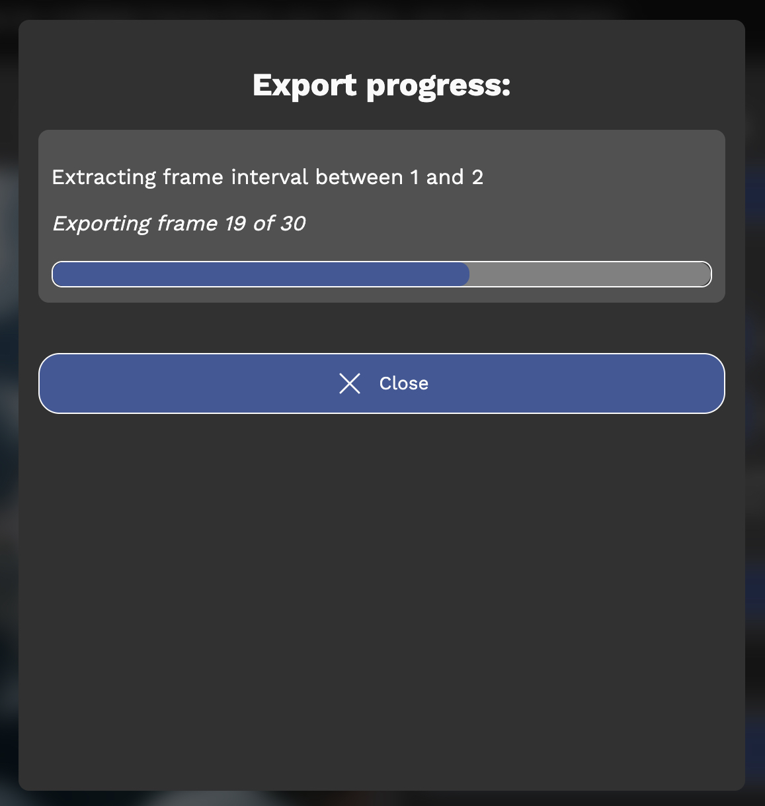

# video-frame-extractor

Extract one (or more) video frames from a video, and export them as an image.

Try it: https://dinoosauro.github.io/video-frame-extractor/

## Usage:

When you open the webpage, you'll be prompted to pick a video file. After you've chosen it, wait up to three second so that the webpage can provide an approximation of the video framerate. Now, you'll see the main UI:

### Video preview:

The first thing you'll see is the video preview. Here you can see your video (muted, but autoplayed by default). You can use either your browser's default controls (that are shown by hovering the cursor on the video) or the buttons below the video to go to the exact frame you want. If you want to go to the previous or next frame, there are two buttons below the video preview that permit you to do so.

### Export frame

In the `Export frame` section, you can choose if you want to export a single frame or an interval.

#### Export a single frame

In this case, you can choose to directly download or share the frame, or to add the frame to a list, so that you can download it later along with other frames. If you want to see all the frames you've added to the list, you can click on the `View frames list` button below. A dialog will appear showing to you all the frames you've added, and you can share/download them, also in a zip file.

#### Export frame interval

You can also download every frame between an interval of seconds. By default, the video playback position will be changed when you edit the textboxes with the from/to interval value, but you can disable it by turning off the `Update the video position while changing from/to seconds` switch.

Finally, you can choose how to save this interval: you can download each image individually (even if this might be blocked on some browser), download them as a zip file or to share them. 

If you decide to download as a zip file, you can choose to download the images using a Service Worker. This should help reducing memory (this is especially useful on iOS, where WebKit has strict memory limits), but it could be instable in some cases. Feel free to disable the `Try using less memory when creating the zip file` if you're facing download issues.

### Change image quality

You can choose to export the frame in a JPEG, PNG or WebP format, if native encoders are available on your browser. You can also choose the output quality in case of a lossy format. 

You can also resize the image, both using percentages (the width/height will be the x% of the original size) or by putting a fixed width or a fixed height.  

### Check progress

If you're downloading more than one image (so, if you're downloading a frame list or a frame interval), you can check the progress by clicking on the document queue icon at the top of the page. 

A dialog will appear showing the current progress for every ongoing operation.

## Settings

In the Settings, you can:
- Change the language;
- Change the colors used by Video Frame Extractor;
    * You can delete the custom theme by writing `?notheme` at the end of the URL.
- See the open source licenses.

## Privacy

Everything is elaborated locally, and nothing is sent to a server. Everything can be also done offline, if the user installs the website as a Progressive Web App.
